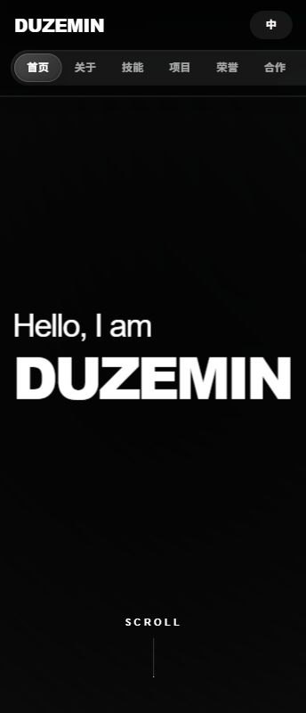

# iDur

一个基于 Next.js 构建的个人作品集与简历展示站点，采用黑白极简视觉风格，包含动态首屏、个人介绍、技能展示、项目经历、荣誉证书、合作意向和联系表单等模块。


## Preview



## Features

- 响应式个人作品集页面，适配桌面端和移动端。
- 黑白极简风格，包含玻璃质感导航、滚动进度和细腻动效。
- Three.js Shader 动态首屏背景。
- Framer Motion 页面过渡、卡片悬浮和滚动进入动画。
- 中 / EN 双语切换，主要内容支持英文展示。
- 项目经历、技能标签、荣誉证书和联系信息集中展示。
- 联系表单支持前端校验，并可通过 Web3Forms 提交。

## Tech Stack

| Category | Stack |
| --- | --- |
| Framework | Next.js 14 |
| UI | React 18, TypeScript |
| Styling | Tailwind CSS, CSS Modules / inline CSS blocks |
| Animation | Framer Motion |
| 3D / Shader | Three.js |
| Tooling | ESLint, PostCSS, npm |

## Getting Started

### Prerequisites

- Node.js 18.17 or newer
- npm

### Install

```bash
npm install
```

### Development

```bash
npm run dev
```

Open [http://localhost:3000](http://localhost:3000) in your browser.

### Production Build

```bash
npm run build
npm run start
```

### Lint

```bash
npm run lint
```

## Environment Variables

The contact form can submit through Web3Forms. Create a local `.env.local` file when you need real form submission:

```env
NEXT_PUBLIC_WEB3FORMS_KEY=your_web3forms_access_key
```

`.env.local` is ignored by Git and should not be committed.

## Project Structure

```text
iDur/
+-- app/
|   +-- globals.css
|   +-- layout.tsx
|   +-- page.tsx
+-- components/
|   +-- huansen-page.tsx
|   +-- huansen-styles.ts
|   +-- i18n.tsx
|   +-- portfolio-enhancers.tsx
|   +-- portfolio-sections.tsx
|   +-- shader-animation.tsx
+-- docs/
+-- next.config.mjs
+-- package.json
+-- tailwind.config.ts
+-- tsconfig.json
```

## Main Modules

- `app/page.tsx`: Next.js home page entry.
- `components/huansen-page.tsx`: Page shell, hero section, intro animation and global visual composition.
- `components/portfolio-sections.tsx`: Navigation, profile, skills, projects, honors, collaboration and contact sections.
- `components/i18n.tsx`: Lightweight Chinese / English translation context.
- `components/shader-animation.tsx`: Three.js shader background.
- `components/portfolio-enhancers.tsx`: Scroll progress and cursor interaction enhancements.

## Deployment

This project can be deployed to any platform that supports Next.js, such as Vercel, Netlify, or a Node.js server.

Recommended production flow:

```bash
npm install
npm run build
npm run start
```

For static or platform-specific deployment, adjust the Next.js configuration according to the target platform.

## Git Hygiene

The repository keeps generated and local-only files out of version control:

- `node_modules/`
- `.next/`
- `out/`
- `dist/`
- `.env` and `.env.*`
- local deployment/update artifacts
- debug logs and OS metadata files

## Author

Designed and built as a personal portfolio project for iDur.
